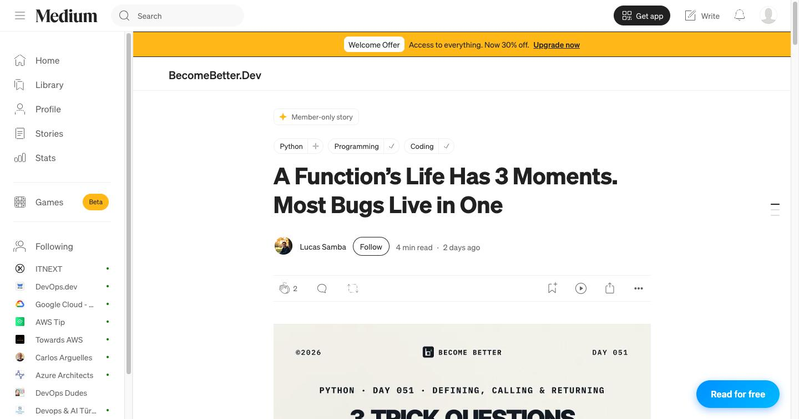
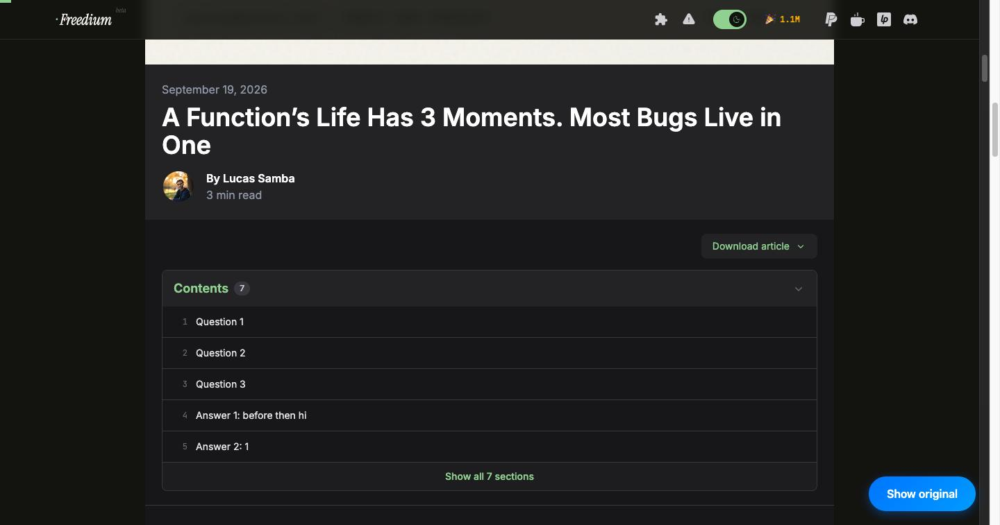

# FreeMedium

Chrome extension (Manifest V3) that lets you read paywalled Medium articles via the [Freedium](https://freedium-mirror.cfd) mirror, without leaving the Medium page.

## Demo

**1. A member-only story on Medium** — the floating **Read for free** button appears bottom-right.



**2. Same tab, one click later** — the article is rendered from Freedium inside a full-screen overlay. **Show original** toggles back to Medium.



## How it works

- On any Medium article a floating **Read for free** button appears; the article is loaded from Freedium inside a full-screen overlay.
- Article pages open the overlay automatically; home, tag and profile pages keep it closed.
- The Freedium iframe is prefetched at `document_start`, so it is usually ready by the time the page is.
- Medium's SPA navigation (`history.pushState`) is tracked so the overlay follows you from the feed into an article.
- Works on `medium.com`, `*.medium.com` and custom-domain Medium publications.

## Install (unpacked)

1. Clone this repo.
2. Open `chrome://extensions`, enable **Developer mode**.
3. Click **Load unpacked** and select the repo folder.

## Project layout

```
manifest.json
src/
  shared-constants.js       host, element IDs, labels, event names
  medium-page-detection.js  is this Medium? is this an article?
  freedium-connection.js    URL rewriting + preconnect
  overlay-ui.js             OverlayUi class (button, overlay, iframe, loader)
  content.js                entry point: prefetch → SPA sync → init
  medium-history-hook.js    MAIN-world patch of history.pushState/replaceState
  freedium-frame.js         runs inside the Freedium iframe, dismisses its "Support" modal
styles/overlay.css
images/
```

Content scripts can't use ES modules, so the isolated-world scripts share a `globalThis.FreeMedium` namespace and are loaded in the order listed in `manifest.json`.

## Disclaimer

For personal/educational use. Please support writers you enjoy by subscribing to Medium.
